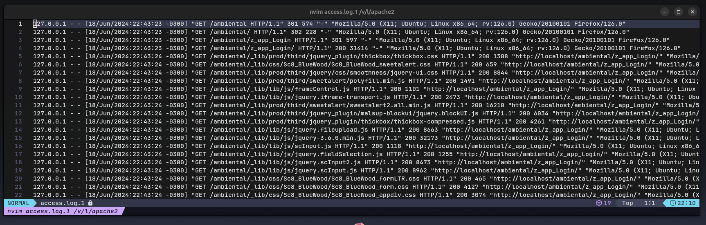

# Kafka Access log reader

A simple kafka project using apache web server to read access logs using regex on a kafka-producer and a config kafka-consumer to deal with that data.

### Architeture

- Apache web server
- MySQL/MariaDB database
- Kafka
- Python 3.\*

## Objective

Make a application using regex and python to read a log file, then storage the important data in MySQL/MariaDB database for distributed analysis, such as marketing, sales or support team.

Above we can see a example of a log file and how many data can be extract from there, such as datetime, ip address, geolocation and more.

This is why is important have a project to analysis that data for the teams of a company, startup or personal project.

### Quickstart

- Install _apache server_ by click on this [link to a tutorial made by official Ubuntu website](https://ubuntu.com/tutorials/install-and-configure-apache#1-overview).

- Install MySQL/MariaBD database by click on this [link to a tutorial made by official MariaDB website](https://mariadb.com/kb/en/installing-mariadb-deb-files/) of how install on a ubuntu machine.

- Install Kafka by follow this [Official Apache Kafka link over here.](https://kafka.apache.org/downloads)
- Install Python 3.\* or download the source file [over here](https://www.python.org/downloads/)

### Hands on

Now everything is set up, start by this:

- Kafka Zookeeper
- Kafka topic
- Kafka Python Producer
- Kafka consumer
- Apache Web Server
- Database
