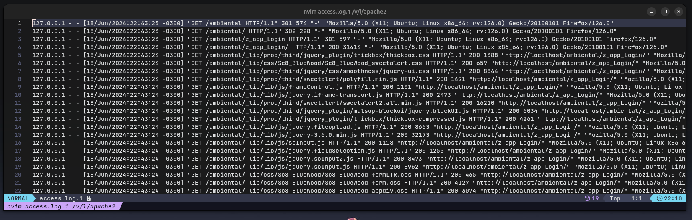

# Kafka Producer for Apache Web Server Logs

This Python script monitors the Apache log file and sends relevant data to a Kafka topic using regular expressions to filter information.

## Libraries Used

- `time`: For intervals between file readings.
- `re`: To apply regular expressions.
- `datetime`: To timestamp the sending of messages.
- `KafkaProducer`: To send messages to Kafka.

## Script Functionality

1. Opens the Apache log file.
2. Defines a regular expression to filter desired information.
3. Enters an infinite loop, reading the log file line by line.
4. If a line is found, it is processed and sent to the specified Kafka topic.
5. Records the time of the message being sent.

## Example Code

```python
log_file = open(r"/var/log/apache2/access.log", "r")
regexp = r'^([\d.]+) (\S+) (\S+) \[([\w:/]+)\s[+\-]\d{4}\] "(.+?)" (\d{3}) (\d+|-) "([^"]+)" "([^"]+)"'
my_producer = kp(bootstrap_servers="127.0.0.1:9092")

while True:
    log_line = log_file.readline()
    if not log_line:
        time.sleep(5)
    else:
        x = re.match(regexp, log_line).groups()
        msg = bytes(str(x), encoding="ascii")
        my_producer.send("apachelog", msg)
        print("Message was sent on: ", datetime.datetime.now())
```

## Example of a log file generated by Apache Web Server



We can use Python or other program language to get only specific data and send to specific groups.
In kafka, we can create groups of consumers to get informations like _ip address_, _date and time_, _geolocation_.. which is relevant information for a sales or marketing team.
